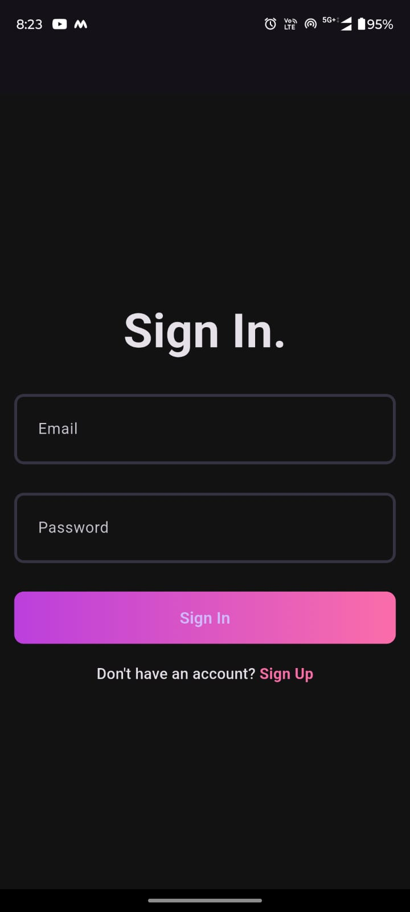
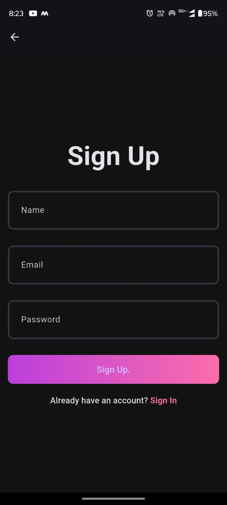
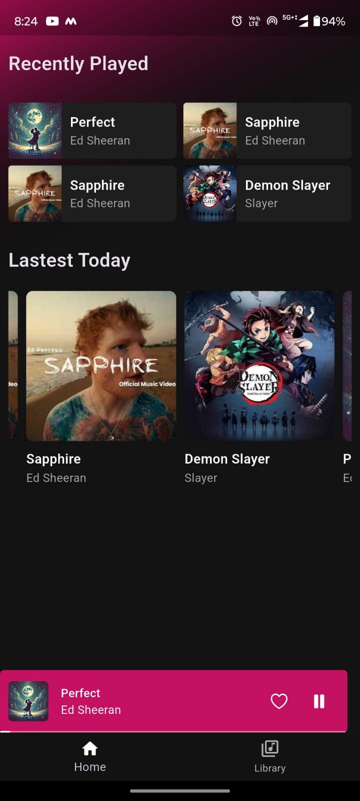
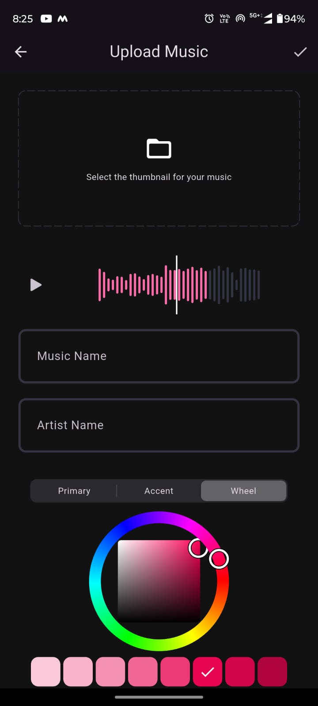

# 🎵 Musync - Full Stack Music Streaming App

**Musync** is a full-stack music streaming app built with **Flutter (frontend)** and **FastAPI (backend)**. It supports music uploads, playback, playlists, favorites, user authentication, and cloud storage — all with clean, modular architecture.

---

## 🚀 Features

### 📱 Flutter Client (Frontend)
- 🧭 **Riverpod State Management** – Scalable and testable architecture.
- 📱 **Cross-Platform** – Works on Android, iOS, and Web.
- 🎵 **Music Player UI** – Stream uploaded tracks with sleek playback design.
- 📂 **File Picker** – Upload music from device storage.
- 💚 **Favorites** – Organize and relisten easily.
- 🌐 **Responsive UI** – Optimized for multiple screen sizes.

### ⚙️ FastAPI Server (Backend)
- ⚡ **FastAPI** – Modern async Python backend.
- 🧠 **SQLAlchemy ORM** – Pythonic database models and queries.
- 🔐 **JWT Authentication** – Secure login/register.
- 🗃️ **PostgreSQL** – Relational database for tracks, users, playlists.
- ☁️ **Cloudinary** – Store and stream uploaded audio in the cloud.
- 🐳 **Dockerized Setup** – Run the entire backend via Docker.

---

## 📸 Screenshots & Demo

<table>
  <tr>
    <td align="center">
       <b>Login Screen</b>
    </td>
    <td align="center">
       <b>Signup Screen</b>
    </td>
    <td align="center">
       <b>Home Screen</b>
    </td>
  </tr>
  <tr>
    <td align="center">
       <b>Music Player</b>
    </td>
    <td align="center">
       <b>Favorites</b>
    </td>
     <td align="center">
       <b>Upload Music</b>
    </td>
  </tr>
</table>

---
